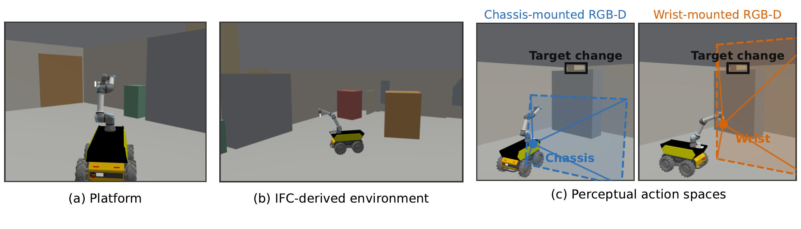
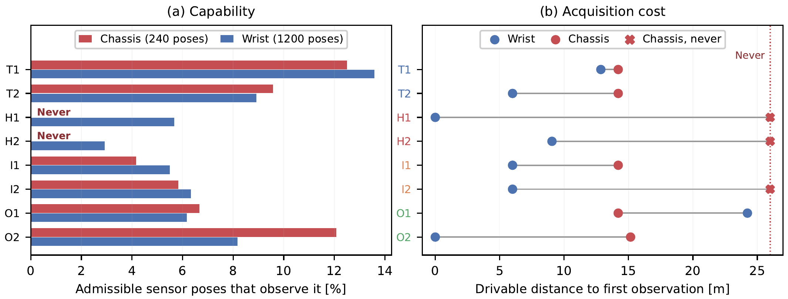
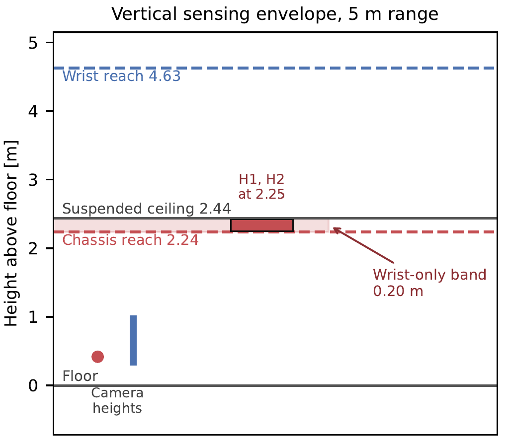

# DeltaSeek

Code and data for **"DeltaSeek: Toward Active Perception in Evolving Construction Environments."**

Construction sites change continuously, so perception there is a poor fit for
static mapping: what changed is exactly what registration handles worst. This
work asks a question that comes before planning where to look — **how does a
robot's sensing embodiment limit what it can observe at all?**

A Husky A300 with a UR5e is evaluated in a room clipped from a real Revit IFC
export, under two RGB-D configurations: one camera fixed to the chassis, an
identical one at the wrist.



*(a)* the platform, *(b)* the room with eight injected changes, *(c)* each
camera's field of view aimed at the same change. The change falls outside the
chassis frustum and inside the wrist one.

## Result

Eight changes, two in each of four observability classes, evaluated
exhaustively over **240 chassis poses** and **1200 wrist poses**.

| Class | Chassis | Wrist |
| --- | --- | --- |
| Trivial | 2/2 | 2/2 |
| Height | **0/2** | 2/2 |
| Incidence | 1/2 | 2/2 |
| Occluded | 2/2 | 2/2 |



The headline is not "5 of 8". A single run confuses what a sensor *can* see
with what one route happened to reach, so the two are measured separately:

- **Two changes are visible from no chassis pose at all.** That is a hard limit
  set by the robot's shape, and no planning recovers it.
- **One more** was missed by the chassis run but is visible from 14 of its 240
  poses — the planner just did not go there. That is routing, not embodiment.

Where both cameras succeed, the difference is travel, not detection: median
drivable distance to first observation is **6.0 m** with the wrist against
**14.2 m** with the chassis.

So embodiment splits into two effects that a planner must treat differently —
**capability**, which is binary and fixed by the robot, and **acquisition
cost**, which is continuous and where planning actually helps.

### Why only height

The highest point a camera can fit inside its frustum is
`h + r·(cos p · tan(v/2) − sin p)` — no yaw term, because yaw turns about the
vertical axis. At 5 m that is **2.24 m** for the chassis camera and **4.63 m**
for the wrist, against a 2.44 m ceiling: a wrist-only band **0.20 m** tall.



## Reproduce it

```bash
source /opt/ros/jazzy/setup.bash
source ros2_ws/install/setup.bash
cd ros2_ws/src/deltaseek_gazebo

ros2 run deltaseek_gazebo sensor_ablation \
  --manifest config/benchmarks/hall_b_ablation_nominal.yaml \
  --scenario config/benchmarks/hall_b_ablation_deviations.yaml \
  --room 2.9 -6.2 9.9 6.3 --start 6.4 4.5 --output-dir ../../../results
```

Takes a few minutes and writes [`results/`](results): the table, per-change
detail, and per-pose observation counts.

To watch it in simulation instead:

```bash
ros2 launch deltaseek_gazebo benchmark.launch.py \
  world_file:=$PWD/generated/ablation/hall_b_ablation_deviated.sdf \
  world_name:=deltaseek_hall_b_ablation_hall_b_ablation \
  ground_truth_file:=$PWD/generated/ablation/hall_b_ablation_ground_truth.yaml \
  x:=6.4 y:=4.5 yaw:=-1.5708 rviz:=true
```

## What is here

| path | |
| --- | --- |
| `ros2_ws/` | the pipeline: IFC import, visibility model, planner, evaluation, 75 tests |
| `clearpath/` | `robot.yaml` — one description drives simulation and hardware |
| `data/` | the source IFC model |
| `generated/` | the simulation world built from it |
| `results/` | measured outputs and the pose-construction audit |
| `docs/` | figures shown above |
| `scripts/paper/` | figure and manuscript tooling |

Deeper detail lives in
[`ros2_ws/.../config/benchmarks/README.md`](ros2_ws/src/deltaseek_gazebo/config/benchmarks/README.md)
— IFC conversion, the deviation schema, the observation model and the traversal
metric — and in [`results/pose_construction.md`](results/pose_construction.md),
which derives the frustum ceiling in closed form and shows the result survives
eightfold finer sampling.

## Setup

ROS 2 Jazzy with `ros-jazzy-clearpath-simulator`. Conda must not be active:
Anaconda's `libstdc++` shadows the system one and `import rclpy` then fails.

```bash
conda config --set auto_activate_base false
source /opt/ros/jazzy/setup.bash
cd ros2_ws && rosdep install --from-paths src --ignore-src -r -y
colcon build --symlink-install && source install/setup.bash
```

IFC conversion needs IfcOpenShell, kept in a separate environment so it cannot
shadow the ROS Python:

```bash
PYTHONPATH=ros2_ws/src/deltaseek_gazebo conda run -n deltaseek-ifc \
  python -m deltaseek_gazebo.ifc_to_manifest --ifc data/ERS_B_STRUCT.ifc \
  --output nominal.yaml
```

## Scope

One room, one ceiling height, eight changes; the 0.20 m band is a property of
that geometry. Detection is geometric — no detector, no renderer, no noise — so
the numbers describe viewpoint quality rather than perception robustness.
Elements are boxes, which discards the 48 opening entities in the source IFC,
so the room is sealed and the robot is spawned inside it.

The manuscript itself is kept in `publication/`, which is not tracked. The
tooling that builds its figures and both document formats is.
